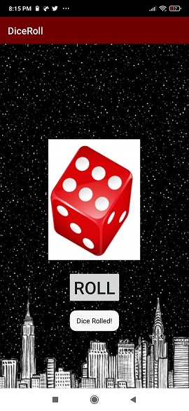
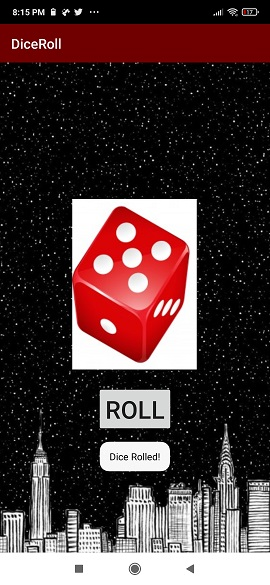

# DiceRoll
Android proyect with kotlin, this is a ramdom game of dice. You can roll a dice that show you a random number on screem

# Install 

Run App on a device or emulator of android whit API 19 or higger

# Try App 

# 1.

# 2.

# 3.

